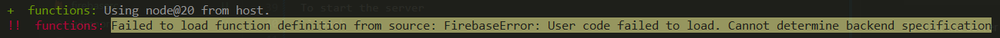

# Backend User Login & Profile
This project serves the purpose of completing a technical test for EBUDDY PTE. LTD.

## Frontend Application
You can find the frontend application related to this repository [here](https://github.com/habibsyuhada/frontend-repo).


## Table of Contents

- [Prerequisites](#prerequisites)
- [Tech Stack](#tech-stack)
- [Installation](#installation)
- [Common Error](#common-error)

## Prerequisites

- [Node.js version 20](https://nodejs.org/en/)

## Tech Stack

`TYPESCRIPT`&ensp;
`NODEJS`&ensp;
`EXPRESSJS`&ensp;
`FIREBASE`&ensp;

## Installation

Clone the project:

```bash
git clone https://github.com/habibsyuhada/backend-repo
```
Go to the project directory
```bash
cd backend-repo
npm install
```
To start the server
```bash
npm run serve
```
or
```bash
npm run dev
```

## Common Error
If you found error `Failed to load function definition from source: FirebaseError: User code failed to load. Cannot determine backend specification`, based on [this reference](https://github.com/firebase/firebase-tools/issues/5888). You can run `npm run serve` twice or downgrade the `firebase-tool`

